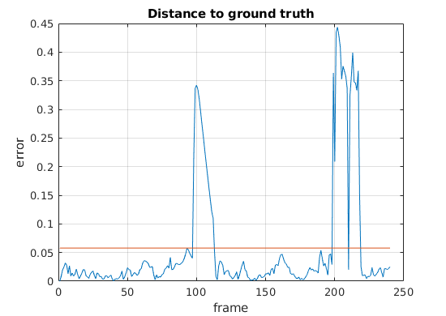

Tracking of object moving along highly non linear trajectory is a challenging task and the Particle Filter is a valid choice for solving this problem because it is able to deal efficiently with multimodal distributions and non linear motion models.
This project summarizes different ways of integrating color feature and edge detections to implement a robust estimator for the tracking problem. Color cues are robust to partial occlusions and are rotational and scale invariant, but they perform poorly when the background is similar to the object to be tracked. Edge detection on the other hand is robust to this kind of problem, but it can be easily tricked by shapes similar to the reference one, like the object shadow.

Two different approaches to solve the tracking problem using the Particle Filter are implemented. Both are based on color and edge feature extraction, but they differ on how the state is represented.
1. Particle Cloud
Every particle represent one pixel and the observation is the RGB value.
The weight of each particle is proportional to the negative exponential of the euclidean distance between the values of the particle and the ones from the reference.
2. Histogram
Every particle is a square subregion of the frame. For each particle a RGB histogram and a Sobel operator histogram is built and compared to the reference histograms to evaluate its weight. 

Results of the particle cloud model

Plot of the euclidean distance between the belief and the groundtruth normalized by the length of the diagonal

Launch tracking.m to test the different models.
Choose the model with the parameter typeOfTracking.

model: 
0 - given a starting point, RGB color based particle cloud
1 - given a starting point, RGB color based particle cloud and edge based histogram
2 - no initial point given, RGB color based particle cloud 
3 - given a starting point, RGB color based histogram
4 - given a starting point, edge based histogram
5 - given a starting point, HSV color based particle cloud and edge based histogram

